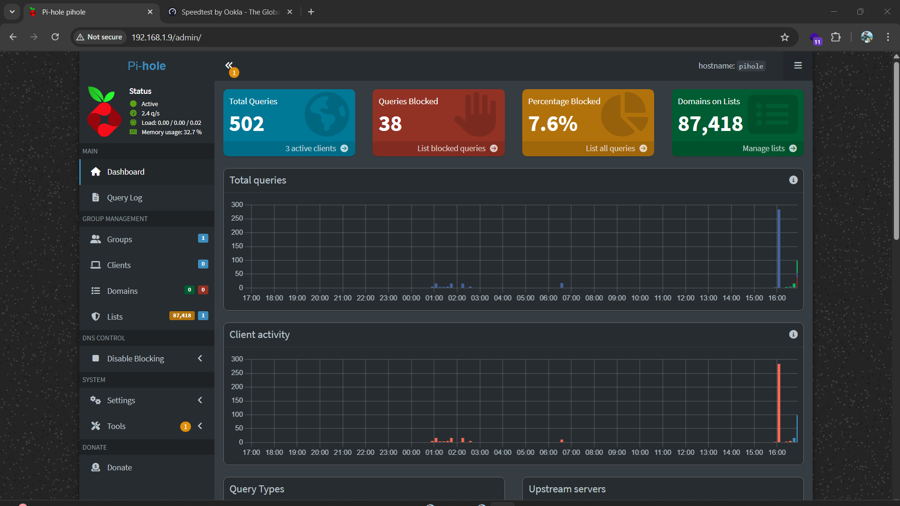

Portable DNS Ad-Blocking System using Pi-hole and Tailscale

Overview
This project implements a DNS-based ad-blocking system using Pi-hole, with remote access enabled via Tailscale. It allows filtering ads and trackers across devices without requiring router-level access.

Architecture
Laptop (Manual DNS: 192.168.1.9)
↓
Pi-hole
↓
Cloudflare DNS
↓
Internet

Remote Access
Laptop → Tailscale → Raspberry Pi

Tech Stack
Pi-hole (DNS filtering)
Tailscale (VPN overlay network)
Raspberry Pi (server)
Linux

Key Features
DNS-level ad and tracker blocking
Real-time query monitoring
Remote access using Tailscale
Manual DNS configuration without router access

Challenges and Solutions

Issue: Slow or broken internet with Tailscale DNS override
Root cause: Full DNS routing through VPN increased latency
Solution: Disabled Tailscale DNS override and used manual DNS configuration

Issue: Network instability due to hotspot setup
Root cause: Double NAT and routing loops
Solution: Connected Raspberry Pi and laptop to the same router

Results
Total Queries: 500+
Ads Blocked: ~7–10%
Stable and fast browsing experience

Limitations
Cannot block YouTube ads
DNS over HTTPS may bypass filtering
Requires manual DNS configuration

Screenshots

Learnings
DNS fundamentals and routing
VPN-based networking using Tailscale
Debugging real-world network issues
System design under constraints

Future Improvements
Add Grafana dashboard
Dockerize the setup
Automate blocklist updates
